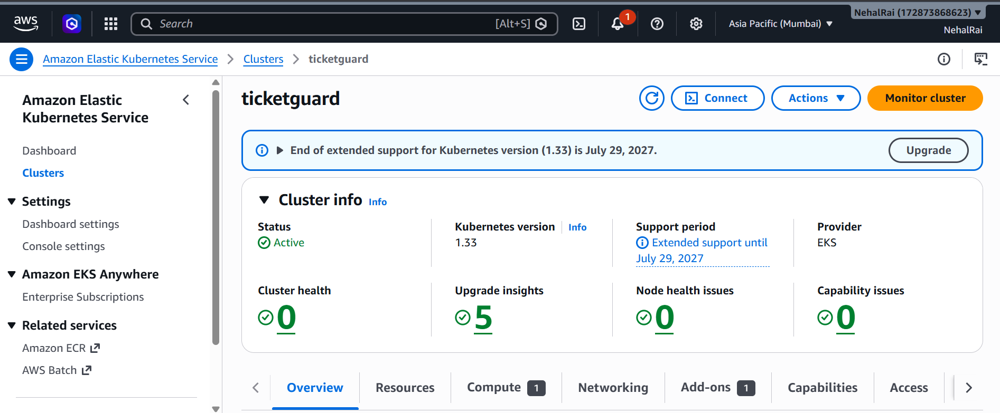
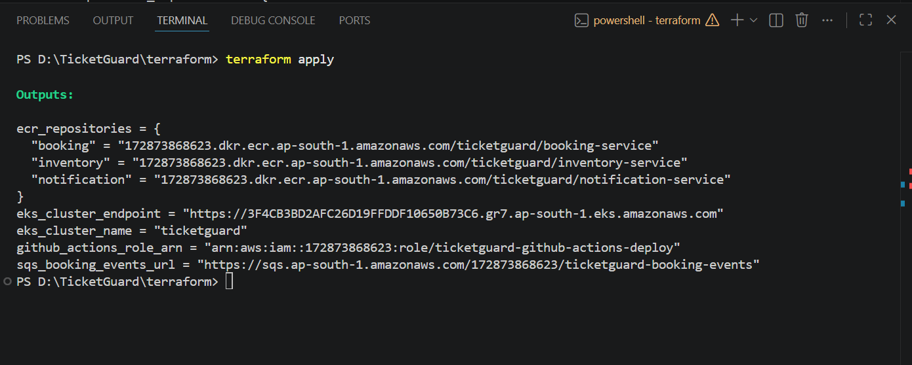

# TicketGuard - Chaos-Tested, Resilient Ticket-Booking Platform

A production-style cloud infrastructure project built with **AWS + Kubernetes + Terraform**, demonstrating idempotent APIs, queue-depth autoscaling, and reliability *proven* under real load and injected infrastructure failure - not just claimed.

---

## What It Does

Systems that work fine under normal load routinely collapse at the exact moment they matter most - a scheduled traffic spike everyone can see coming (Ticketmaster's 2022 Eras Tour on-sale, Healthcare.gov's 2013 launch, university admission portals every cycle). TicketGuard is a ticket-booking backend engineered to survive that spike, with the proof to show it.

- **Booking**: clients submit a booking with an idempotency key - retries (timeouts, double-clicks) never create a duplicate booking.
- **Inventory**: seat availability is decremented atomically (DynamoDB conditional writes) - overselling is structurally impossible, not just unlikely, even under thousands of concurrent requests.
- **Resilience validation**: a k6 load test simulates a 10x on-sale traffic spike, and Chaos Mesh kills pods / injects network latency *during* that spike, while Grafana dashboards confirm defined SLOs still hold.

---

## Architecture

```
k6 Load Test / Users
        │
        ▼
  LoadBalancer (EKS)
        │
        ▼
 booking-service (FastAPI) ──idempotency check──▶ DynamoDB (idempotency-keys)
        │        │
        │        └──reserve seat──▶ inventory-service (FastAPI) ──atomic decrement──▶ DynamoDB (seats)
        │                                   ▲
        │                                   │ kills pods / injects latency
        └──publish event──▶ SQS ──▶ notification-service         Chaos Mesh
                                                                  (mid-load-test)

   booking-service + inventory-service ──metrics──▶ Prometheus ──▶ Grafana (SLO dashboards)
```

**Reliability patterns, not toy versions of them**: idempotency keys, atomic conditional writes, and a circuit breaker + bounded retries between services are the same patterns production payment/booking APIs use - not simplified for the demo.

---

## Tech Stack

AWS (EKS, ECR, DynamoDB, SQS, Secrets Manager, IAM/OIDC) · Terraform · Kubernetes (HPA + KEDA) · Docker · Python (FastAPI) · GitHub Actions · OPA/Conftest · Trivy · Prometheus + Grafana · Chaos Mesh · k6

---

## Engineering Decisions Worth Noting

**Atomic inventory decrement** - Seat reservation uses a DynamoDB conditional update (`SET count = count - 1 WHERE count > 0`) instead of read-then-write application logic, pushing the race-condition guarantee into the database itself.

**Idempotency over best-effort deduplication** - Every booking carries a client-supplied `Idempotency-Key`, checked against a dedicated DynamoDB table before any work happens; a repeated key replays the original result instead of creating a new booking.

**Circuit breaker + bounded retries** - `booking-service` calls `inventory-service` with a short timeout, capped retries, and a circuit breaker that opens after repeated failures - turning a killed dependency into a fast, predictable `503` instead of a cascading failure.

**Queue-depth autoscaling** - `booking-service` scales via KEDA against actual SQS backlog, not just CPU, so it reacts to real demand pressure during a spike.

**Security-gated CI/CD** - GitHub Actions authenticates to AWS via OIDC (no long-lived keys), an OPA/Conftest policy gate fails the build if a Terraform plan would create a wildcard IAM policy, and Trivy scans every image for critical/high CVEs before deploy.

---

## Results

Infrastructure is provisioned entirely from code and confirmed live on AWS:

| EKS Cluster (Active) | Terraform Apply Outputs |
|---|---|
|  |  |

_Grafana dashboard screenshots (booking success rate and p95 latency holding through a Chaos Mesh pod-kill window, mid-load-test) go here after the load + chaos test run - see [`/screenshots`](screenshots)._

---

## Known Simplifications → Production Upgrade Path

| Current (Portfolio) | Production |
|---|---|
| Single region (`ap-south-1`) | Multi-region active-active with Route53 failover |
| IAM user with `AdministratorAccess` for local CLI | Scoped least-privilege policy per task |
| Plaintext env vars for config | AWS Secrets Manager / Parameter Store for all config |
| EKS cluster created/destroyed per test run | Persistent cluster with scheduled cost controls |
| Notification service logs only (no real email/SMS) | Integration with SES / Twilio |

---

## Running Locally

```bash
git clone https://github.com/Nehalrai/ticketguard.git
cd ticketguard

# Local mode - no AWS needed, in-memory stores
kind create cluster --name ticketguard
kubectl apply -f k8s/namespace.yaml
kubectl apply -f k8s/

# Load + chaos test
k6 run load-test/on-sale-spike.js
kubectl apply -f chaos/pod-kill-inventory.yaml   # mid-run
```

Full AWS deployment steps (Terraform apply, ECR push, KEDA/Prometheus/Chaos Mesh install) are in [`BUILD_CHECKLIST.md`](BUILD_CHECKLIST.md).

---

## API Reference

Each FastAPI service exposes interactive OpenAPI docs at `/docs` once running (e.g. `booking-service:8000/docs`). Covers booking creation, idempotency behavior, and inventory reservation endpoints.
